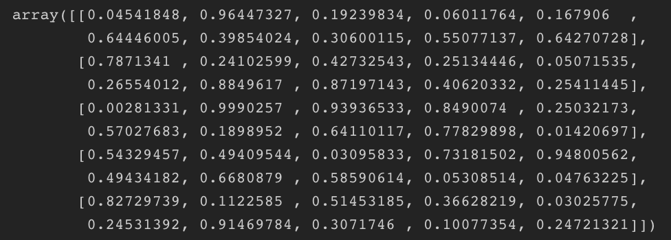

<link rel="stylesheet" type="text/css" href="custom.css">
<hr class="section-divider"></hr>
Despite the fact ample of resources for PCA(Principal component analysis) on the internet, it is intractable to grab whole idea within few hours, let alone implementing that into codes with knowing what we are actually doing. Having said that, we wish we could get the feeling that we can apply PCA into real cases quickly.

In this article, I’ll take a stab at and clearly illustrate the ideas one might find puzzling, which, I assume, that a newbie like me will fall for and stuck in for hours.

Without further ado, let’s get right into it.
<hr class="section-divider"></hr>

First off, PCA is a dimensionality reduction method, more simply, the method for summarizing multiple of characteristics(variables) into few characteristics. Suppose, we attempt to classify, or identify new unknown animal as a ‘dog’ or a ‘cat’, you would need to measure the animal’s characteristics, such as ‘Height’ and ‘Weight’. We can also classify them as ‘color’, ‘shape’, ‘agility’… etc., however, the problem are that animals have tons of characteristics, so we cannot classify them more than three characteristics. More importantly, what if we have 100 *100 characteristics of animals. We cannot compute that much data, however, we can reduce the characteristics into fewer characteristics(known as Principle component), say two or three.

 
<hr class="section-divider"></hr>
Alright, better to implement PCA to get the image. Let’s start by making 5 *10 matrix, and take steps of the process.


 
<br />
```python
import numpy as np
X = np.random.rand(5,10)
```
The column are variables (characteristics) and the row are samples(say, ‘cat’ or ‘dog’).

What we want to do with this matrix is to get eigenvalues and eigenvectors, which turns to be new variable(Principal Component) to describe samples. Let matrix X to be n *p size, then p *p covariance matrix C, where C=XᵀX. Since covariance matrix is hermitian matrix and semi-positive definite matrix, by using spectral theorem, we can get eigenvalues(L: a diagonal matrix with eigenvalues λᵢ) and eigenvectors(V) from C=VLVᵀ. Let’s get a covariance matrix and eigenvalues. But before that, don’t forget to subtract means of each column from the same column.


 
```python
X -= X.mean(axis=0)
C = np.cov(X,rowvar=False)
```


 
We set rowvar=Flase, so that the relationship is transposed: each column represents a variable, while the rows contain observations. Then, we get eigenvalues in w and eigenvectors in v.

```python
from numpy import linalg as LA
w, v = LA.eig(C)
w_ = w.argsort()[::-1] # In order that bigger Eigenvalue comes first
w, v = w[w_], v[:, w_]
At this point, the eigenvectors is 10 *10 matrix. To perform dimensionality reduction from 10 variables to 2 variables, we truncate the matrix.
```


```python
n=2;
n_PC = v[:, 0:n]
```

Then, we want to transform( project X on the principal axes) the original 10 *10 sample into new space (2 dimensions), we use the equation T=X W.

```python
T=np.dot(X, n_PC)
```
We got matrix 5 *2 matrix T, which is projected onto 2 principal components. We finally describe each sample with 2 variables.

Fun part should be visualizing these transformed sample data. Let’s use bigger data. Starting off by defining 200 *2 matrix X.

```python
rng = np.random.RandomState(1)
X_raw = np.dot(rng.rand(2, 2), rng.randn(2, 200)).T
X_mean = X_raw.mean(axis=0)
X -= X_mean
C = np.cov(X.T) # Now shape is 2 *2 
w, v = LA.eig(C)
ind = w.argsort()[::-1]
w, v = w[ind], v[:, ind]
```

(In this case, eigenvalues are two, therefore we actually don’t need to truncate it into two)

```python
w_12 = w[:2]
v_12 = v[:,:2]
```
Finally plot. Let’s not forget to set axis ‘equal’ , so that we can see an orthogonality of principal components. Otherwise, we will get a non perpendicular result.

```python
import seaborn as sns; sns.set()
ax = plt.gca()
ax.set_xlabel('Principal component 1')
ax.set_ylabel('Principal component 2')
plt.scatter(X_raw[:, 0], X_raw[:, 1], c='#663399', alpha=0.5)
plt.scatter(X_mean[0], X_mean[1], c='red', s=50)
plt.axis('equal')
for length, vector in zip(w_12, v_12):
    vector[0] = -vector[0]               # Little tweak the sign 
    dir_ = vector * 3  * np.sqrt(length) # Standard Deviation 3
    start = X_mean; end = start + dir_
    arrowprops = dict(arrowstyle='->', linewidth=2, shrinkA=0, shrinkB=0, color='red', alpha=0.5)
    ax.annotate('', xy = end, xytext = start, arrowprops=arrowprops)
```


Let’s plot transformed samples as well.

```python
T = X.dot(v) # Projecting sample data
T = T[:, 0:2]
T_mean = T.mean(axis=0)
C_T = np.cov(T.T) # Shape 2 *2
wT, vT = LA.eig(C_T)
indT = wT.argsort()[::-1]
wT, v = wT[indT], vT[:, indT]
```

Finally plot.
```python
ax = plt.gca()
ax.set_xlabel('Principal component 1')
ax.set_ylabel('Principal component 2')
plt.scatter(T[:, 0], T[:, 1], c='#663399', alpha=0.5)
plt.scatter(T_mean[0], T_mean[1], c='red', s=50)
for length, vector in zip(w_12_T, v_12_T):
    dir_ = vector * 3  * np.sqrt(length)
    arrowprops = dict(arrowstyle='->', linewidth=2, shrinkA=0, shrinkB=0, color='red', alpha=0.5)
    dir_[0] = -dir_[0]
    start = X_mean; end = start + dir_
    ax.annotate('', xy = end, xytext = start, arrowprops=arrowprops)
```


As we can see, the two principal components are orthogonal, since they are decorrelated by PCA so that variables are independent each other.

Also sample data is transformed (scattered evenly) along with two principal axes.

Why do we use Eigendecomposition(or Singular value decomposition for efficiency), and use some of the largest Eigenvalues and corresponding eigenvectors? This is because the purpose of PCA is reduce the dimensionality, but at the same time to describe the samples as much as possible with few variables. In other words, we want the variable which varies among each samples, and don’t want the variable which is the same among the samples. We can accomplish this idea by using larger eigenvalue, or larger variance. Based on the information theoretic point of view, the largest variance corresponds to the dimension with largest entropy, therefore, largest variance encodes most information. However, Eigendecomposition is costy. Suppose, we have image samples, say 100 *100 pixels, and that means it has 10,000 variables. Its covariance matrix C will be 10,000 *10,000 dimensions. Therefore, we often prefer SVD(Singular value decomposition) to reduce the dimension size as small as a sample size rather than a variable size. Let’s give it a try, and plot sample with SVD.

```python
rng = np.random.RandomState(1)
X_raw = np.dot(rng.rand(2, 2), rng.randn(2, 200)).T
X_mean = X_raw.mean(axis=0)
X -= X_mean
U, s, Vt = LA.svd(X, full_matrices=False)
V = Vt.T
S = np.diag(s)
e_values = (s ** 2) / X.shape[0]
```

SVD decomposes covariance matrix C, where C=XXᵀ, into C=USVᵀ, where S is a (rectangle) diagonal matrix containing singular values sᵢ, U is a unitary matrix, and V are principal directions. In terms of a singular value sᵢ, we can use λᵢ = (sᵢ**2)/n, where n is the sample size, λᵢ are Eigenvalues.

```python
ax = plt.gca()
ax.set_xlabel('X'); ax.set_ylabel('Y')
plt.scatter(X_raw[:, 0], X_raw[:, 1], c='#B8860B', alpha=0.5)
plt.scatter(X_mean[0], X_mean[1], c='red', s=50)
plt.axis('equal')
for length, vector in zip(e_values, V):
    dir_ = -vector * 3  * np.sqrt(length) # Tweak the sign
    start = X_mean; end = start + dir_
    arrowprops = dict(arrowstyle='->',linewidth=2, shrinkA=0, shrinkB=0, color='red', alpha=0.5)
    ax.annotate('', xy=end, xytext=start, arrowprops=arrowprops)
```

From this results, we see exactly the same principal components by means of SVD and Eigendecomposition.

One might would like to observe how far each point from the center. As one of ways to do is to draw an equiprobability, or an error eclipse. This is especially helpful to see the sample which is in the middle of two groups, for instance, we can use this for K-means clustering.

```python
from matplotlib.patches import Ellipse
import matplotlib as mpl
ax = plt.gca(); ax.set_xlabel('X'); ax.set_ylabel('Y')
plt.scatter(X_raw[:, 0], X_raw[:, 1], c='#B8860B', alpha=0.5)
plt.scatter(X_mean[0], X_mean[1], c='red', s=50)
U_, s_, _ = LA.svd(np.cov(X, rowvar=False), full_matrices=False)
angle = np.degrees(np.arctan2(U_[1,0], U_[0,0]))
width, height = 2 * np.sqrt(s_)
for nsig in range(1, 4):
    args = [X_mean, nsig*width, nsig*height, angle]
    kwargs = dict(color='#008000', edgecolor='k', alpha=nsig*0.1, linewidth=2, fill=False)
    ell = mpl.patches.Ellipse(*args, **kwargs)
    ell.set_clip_box(ax.bbox)
    ax.add_artist(ell)
    # Or ax.add_patch(Ellipse(*args,**kwargs)) instead
```


We start with import modules. Then, we want to decompose the covariance matrix of an original sample with SVD. The unitary matrix U_ is used for rotation the sample data, now we use U_[0] and U_[1], cosine, sine, respectively, so that we can get tangent for calculating


the angle. The angle is from x axis. When axes are defined by the standard deviation, the eclipse is defined by the equation, (x/σ₁)²+(y/σ₂)²=s, where σ₁ is a standard deviation of x axis, σ₂ is a standard deviation of y axis, and s is a variance of the sample.

x=2σ₁√s means one standard deviation. We plot three times in the code above.

The third circle contains most of the sample data on the image, since it supposed to be a 99.7% of confidence interval.

We can use Scikit-learn for PCA. Let’s run through the same sample one more time. Staring with sample data as usual.

```python
rng = np.random.RandomState(1)
X_raw = np.dot(rng.rand(2, 2), rng.randn(2, 200)).T
X_mean = X_raw.mean(axis=0)
X = X_raw - X_mean
```
Defining the 200 *2 matrix X, we use two components for the plot’s sake.

```python
from sklearn.decomposition import PCA
pca = PCA(n_components=2)
pca.fit(X) # Apply PCA
ax = plt.gca(); ax.set_xlabel('X'); ax.set_ylabel('Y')
plt.scatter(X[:, 0], X[:, 1], alpha=0.3, color="#191970")
plt.scatter(pca.mean_[0], pca.mean_[1], c='red', s=50)
plt.axis('equal')
```
The rest of process is the same as before.
```python
for length, vector in zip(pca.explained_variance_, pca.components_):
    dir_ = vector * 3  * np.sqrt(length)
    start = pca.mean_; end = start + dir_
    arrowprops = dict(arrowstyle='->',linewidth=2, shrinkA=0, shrinkB=0, color='red', alpha=0.5)
    ax.annotate('', xy=end, xytext=start, arrowprops=arrowprops)
```

Not to mention, the result is the same.

As we can see above code, we can access the largest eigenvectors via components_ and eigenvalues via explained_variance_.


Let’s take a look at the explained_variance_

Major principal component explains 97.6% [0.7625315/(0.7625315+0.0184779)] of sample data and second principal component does the rest. That means that we can almost describe original data without second principal component. Scikit-learn already calculates the explained variance radio, so we can use via explained_variance_ratio_.

For better understandings, let’s use 1797 *64 matrix digits data, and reduce those dimensions 64 to 10.
```python
from sklearn.datasets import load_digits
digits = load_digits()
pca = PCA(n_components=10).fit(digits.data)
```

Now we can see how much these new 10 components can describe original sample data.

```python
plt.plot(np.cumsum(pca.explained_variance_ratio_),'o-', c='#663399', alpha=.5)
plt.xlabel('Number of components')
plt.ylabel('Cumulative explained variance')
```


As it turns out, it described 72\~73% of sample instead of using 64 dimensions that ensures 100% of accuracy. Notice that in the left graph the first component is index 0, that’s why the graph begins from 14\~15% of variance.

Suppose how many of components should be needed to get 90% of accuracy then? We can blank the PCA function and to plot the graph first.

```python
pca = PCA().fit(digits.data) # Blank inside the closed bracket
plt.plot(np.cumsum(pca.explained_variance_ratio_),'o-', c='#663399', alpha=.5)
plt.xlabel('Number of components')
plt.ylabel('Cumulative explained variance')
```


We would interpret around 20 components should be good enough for 90% of variance. The simpler way for this is to add the digit into the function directly.
```python
pca = PCA(.9)
```
For further understandings, let’s inverse the transformed sample data into original data, and apply heatmap to them. We should observe that the more the number of components is, the more precise it creates sample data.


```python
# Heatmap 1
sns.heatmap(digits.data, cbar=False)
```


```python
# Heatmap 2
pca = PCA(2)
PC = pca.fit_transform(digits.data)
inversed = pca.inverse_transform(PC)
sns.heatmap(inversed, cbar=False
```


```python
# Heatmap 3
pca = PCA(20)
PC = pca.fit_transform(digits.data)
inversed = pca.inverse_transform(PC)
sns.heatmap(inversed, cbar=False)
```


```python
# Heatmap 4
pca = PCA(40)
PC = pca.fit_transform(digits.data)
inversed = pca.inverse_transform(PC)
sns.heatmap(inversed, cbar=False)
```

Clearly the original has a lot more features than inversed data with two principal components. Using forty principal components, we can more precisely inverse the transformed data.

We actually can show the digits data we are dealing with so far.

```python
_, axes = plt.subplots(2, 8, figsize=(8, 2), 
subplot_kw={'xticks':[], 'yticks':[]},
gridspec_kw=dict(hspace=0.1, wspace=0.1))
for i, ax in enumerate(axes.flat):
    ax.imshow(digits.data[i].reshape(8, 8), cmap='binary', interpolation='nearest', clim=(0, 16))
```


Let’s make these digits images rougher, or more precisely, once perform dimensionality reduction and inverse the digits image to the original size.

```python
pca = PCA(2)
PC = pca.fit_transform(digits.data)
inversed = pca.inverse_transform(PC)
_, axes = plt.subplots(4, 10, figsize=(10, 4), 
                        subplot_kw={'xticks':[], 'yticks':[]},
                        gridspec_kw=dict(hspace=0.1, wspace=0.1))

for i, ax in enumerate(axes.flat):
    ax.imshow(inversed[i].reshape(8, 8), cmap='binary', interpolation='nearest', clim=(0, 16))
```


We can also apply PCA to Eigenfaces, since its feature is only brightness like digits image above. In terms of reconstructing the original data, we take a slightly different step from digits reconstruction. Since we need an average face first. After inverting transformed data, we add the average face. Suppose we want an inversed face image X, X is described as X=μ+w₁*v₁+w₂*v₂+…+wᵢ*vᵢ, where μ is a mean, (w₁, w₂,…,wᵢ|wᵢ∈ US) are principal components, and (v₁, v₂,…,vᵢ| vᵢ∈ V) are Eigenvectors.

```python
from sklearn.datasets import fetch_lfw_people

faces = fetch_lfw_people(min_faces_per_person=60)
face_data_raw = faces.data
average_face = face_data_raw.mean(axis=0)
face_data = face_data_raw - average_face

pca = PCA(100)
pca.fit(face_data)
PC = pca.transform(face_data)
inversed = pca.inverse_transform(PC)
inversed_faces = inversed + average_face

fig, ax = plt.subplots(2, 5, figsize=(5, 2.5),
                        subplot_kw={'xticks':[], 'yticks':[]},
                        gridspec_kw=dict(hspace=0.1, wspace=0.1))

for i in range(5, 10):
    ax[0, i-5].imshow(faces.data[i].reshape(62, 47), cmap='binary_r')
    ax[1, i-5].imshow(inversed_faces[i].reshape(62, 47), cmap='binary_r')
```


As we discussed before, SVD well performs when the dimensions are vast. For instance, these image is 62 *47 = 2914 dimensions. We need to compute the 2914 *2914 dimensions of the correlation matrix if we use Eigendecomopsition. Instead, SVD can calculation by sample size * sample size.

```python
truncated = faces.data[:500] # 500 *2914 Matrix
average_face = truncted.mean(axis=0)
face_data = truncted - average_face
U, s, Vt = LA.svd(face_data, full_matrices=False)
S = np.diag(s)
#U: 500 *500, S: 500 *500, Vt:500 *2914
```
Principal components are given by XV=US. We reduce the dimensions from 500 to 100, now US is a 500 *100 matrix.

```python
dim = 100 
US = U[:, 0:dim].dot(S[0:dim, 0:dim])
```
To compare with original face images, we want to project US, and to inverse it to X. We apply the equation X=USVᵀ, and get 500 * 2914 matrix X.

```python
X = US.dot(Vt[:dim,:])
X = X + average_face
```
Finally plot the images.
```python
fig, ax = plt.subplots(2, 5, figsize=(5, 2.5),
                        subplot_kw={'xticks':[], 'yticks':[]},
                        gridspec_kw=dict(hspace=0.1, wspace=0.1))
for i in range(5, 10):
    ax[0, i-5].imshow(faces.data[i].reshape(62,47), cmap='binary_r')
    ax[1, i-5].imshow(X[i].reshape(62,47), cmap='binary_r')
```

The resulting images are not as blur as the prior scikit-learn method. Seeming to be better method, the fewer data we use, the more clear projected images are. This is because less noises from samples, and the machine uses less filters. This will lead itself to predict low for new images, which the machine has never seen before.

Eigenvectors that composes these faces are called Eiganface, each Eigenvector has a unique mask.


```python
N = 5
fig, ax = plt.subplots(1, N, figsize=(5, 2.5),
                        subplot_kw={'xticks':[], 'yticks':[]},
                        gridspec_kw=dict(hspace=0.1, wspace=0.1))
for i in range(1, N+1):
    ax[i-1].imshow(Vt[i].reshape(62, 47), cmap = 'binary_r')
```

The average face is a foundation of face images.

Here is the overview of SVD’s process for Eigenface.


<hr class="section-divider"></hr>

### Reference

[Relationship between SVD and PCA. How to use SVD to perform PCA?](https://stats.stackexchange.com/questions/134282/relationship-between-svd-and-pca-how-to-use-svd-to-perform-pca/)

Principal component analysis (PCA) is usually explained via an eigen-decomposition of the covariance matrix. However…
stats.stackexchange.com    


[Making sense of principal component analysis, eigenvectors & eigenvalues](https://stats.stackexchange.com/questions/2691/making-sense-of-principal-component-analysis-eigenvectors-eigenvalues)
In today’s pattern recognition class my professor talked about PCA, eigenvectors &amp; eigenvalues. I got the…
stats.stackexchange.com    


[How to draw an error ellipse representing the covariance matrix?](http://www.visiondummy.com/2014/04/draw-error-ellipse-representing-covariance-matrix/)
In this post, I will show how to draw an error ellipse, a.k.a. confidence ellipse, for 2D normally distributed data…
www.visiondummy.com    

[Feature extraction using PCA — Computer vision for dummies](http://www.visiondummy.com/2014/05/feature-extraction-using-pca/)

In this article, we discuss how Principal Component Analysis (PCA) works, and how it can be used as a dimensionality…

[Eigenfaces — Scholarpedia](http://www.scholarpedia.org/article/Eigenfaces#fig:PIE.jpg)
The eigenfaces may be considered as a set of features which characterize the global variation among face images. Then…
www.scholarpedia.org    

[Principal Component Analysis (PCA) for Feature Selection and some of its Pitfalls](http://jotterbach.github.io/2016/03/24/Principal_Component_Analysis/)

A typical approach in Data Science is what I call featurization of the Universe. What I mean by that is that we extract…
jotterbach.github.io
